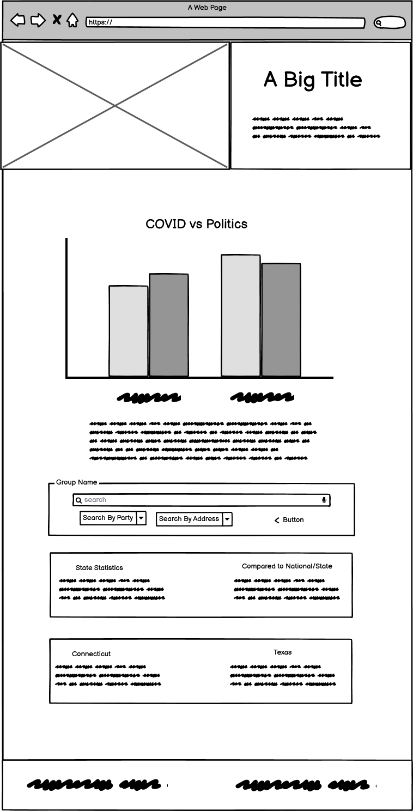

# Overview

* As we come to the end of 2020 which consisted of a devastating pandemic and a divisive election, it is clear in America that the attitude of political parties towards the novel Coronavirus has a profound impact on how it is dealt with. This app is meant to speculate on this correlation by using resources offered by multiple APIs to compare political parties with the impact of the virus. By measuring the affiliations of a region towards democratic, republican, or other, and charting it up against COVID-19 statistics, this application hopes to give insight into how municipalities represented by certain political parties deal with the virus. As the numbers of COVID-19 related cases and deaths start to ramp up entering the Winter, many people will be interested in how newly elected representatives are combatting the virus. The application will provide information for multiple political parties at varying levels of government. The application will display statistics of a state's political affiliation, whether red, blue or other, and actively update COVID-19 data as cases and deaths occur and as newly elected officials take office.

# Application Description

* This application will utilize Google's Civic Information API in order to obtain data on elected representatives by region across the United States. By compiling this data, a user will be able to search at the state level and see the political affiliations of the governor, senators, house representatives, and other elected officials from that state. By also using the COVID 19 Tracking Proect API, the application will be able to provide data on testing, cases, hospitalizations, and deaths at the state and national level. These two APIs will combine into a mashup that provides the user with useful information on how effective their representatives are at keeping them safe and which parties do it best.

* When the user lands on our site, they will most likely first be interested in how their particular state is handling the virus compared to the rest of the nation. The user will be able to immediately view an overall chart of the national COVID-19 statistics charting political parties and how they score on their handling of COVID-19. Searching by state will allow the user to view the COVID-19 statistics and the political parties that represent that state. The application will then attempt to chart political affiliations versus testing, cases, and death as time goes on and the user will be able to see how states are handling the virus as we enter 2021 and a new presidential inauguration.

* The user of this application will also want to compare each state to other states or to the national level. It will provide the searching tools for the user to, for example, compare a predimonantly red state to the national average of COVID deaths, or compare certain states to one another.

* This application will consist of a single page and will utilize node.js to provide server side logic, the axios library to make asynchronous http requests, SASS, and Boostrap to provide a CSS framework.

# Web APIs

* This API will use two APIs: Google's Civic Information API and the COVID Tracking Project API to obtain it's most up to date information on government representatives and COVID-19 statistics. 

### Google's Civic Information API

* This API will allow the application to obtain government elected officials by locality and political affiliation. 

* The documentation for this API can be found at *https://developers.google.com/civic-information/docs/v2*

### COVID Tracking Project API

* This API will provide the COVID-19 statistics at state and national levels both current and historic.

* The documentation for this API can be found at *https://covidtracking.com/data/api*

# Mockup

* The general layout of this website will be a single page in which the user will land and make asynchronous requests to search statistics about the states or regions the user wants to compare.

